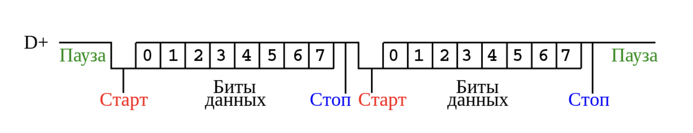
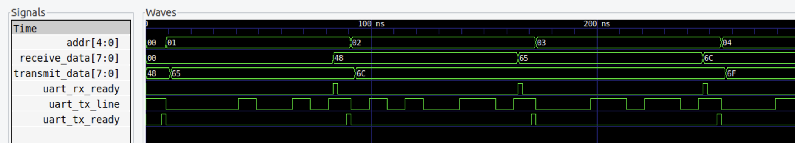

### Реализация интерфейса UART на языке **Verilog**

Универсальный асинхронный приёмопередатчик (**УАПП**, англ. Universal Asynchronous Receiver-Transmitter, **UART**) — узел вычислительных устройств, предназначенный для организации связи с другими цифровыми устройствами. Преобразует передаваемые данные в последовательный вид так, чтобы было возможно передать их по одной физической цифровой линии другому аналогичному устройству. Метод преобразования хорошо стандартизован и широко применяется в компьютерной технике.

Принято соглашение, что пассивным (в отсутствие потока данных) состоянием входа и выхода UART является логическая 1(true). Стартовый бит всегда является логическим 0(false), поэтому приёмник UART ждёт перепада из 1 в 0(англ. falling edge) и отсчитывает от него временной промежуток в половину длительности бита (середина передачи стартового бита). Если в этот момент на входе всё ещё 0, то запускается процесс приёма минимальной посылки. Для этого приёмник отсчитывает 9 битовых длительностей подряд (для 8-битных данных), и в каждый момент фиксирует состояние входа. Первые 8 значений являются принятыми данными, последнее значение - проверочное стоп-бит (англ. Stop bit) Значение стоп-бита всегда равно 1.





## Модули на языке Verilog: 
- **rom.v** - ROM-память, инициализирующася из файла **misc/rom_contents.txt**
- **rom_fetcher.v** - модуль, последовательно считывающий содержимое ROM
- **clock_div.v** - делитель частоты
- **uart_tx.v** - transmitter UART
- **uart_rx.v** - receiver UART
- **testbench.v** - тестовый модуль, запускающий симуляцию 

## Параметры передачи
Для tx и rx модулей определены общие значения параметров приема-передачи:
- CLK_FREQ - частота тактирования сигнала **clk**
- BAUDRATE - скорость bits per second
- DATA_WIDTH - размер посылки в битах 
- STOP_BIT_SIZE - размер бита - 1, 1.5 или 2

## UART TX
```
module uart_tx #(
    parameter CLK_FREQ = 50000000, 
    parameter BAUDRATE = 9600, 
    parameter DATA_WIDTH = 8, 
    parameter STOP_BIT_SIZE = 1) 
(
    /* Clocking signal */
    input wire clk,

    /* Start transmission signal */
    input wire start,
    
    /* Input data */
    input wire [DATA_WIDTH - 1:0]transmit_data,
    
    /* TX line */
    output reg line = 1'b1,

    /* Transmitter ready to work */
    output wire ready
);
```

- **clk** - сигнал тактирования 
- **start** - флаг для начала процесса отправки
- **transmit_data** - посылка
- **line** - выходная линия данных
- **ready** - флаг готовности модуля для отправки следующей посылки

## UART RX
```
module uart_rx #(
    parameter CLK_FREQ = 50000000, 
    parameter BAUDRATE = 9600, 
    parameter DATA_WIDTH = 8, 
    parameter STOP_BIT_SIZE = 1)
(
    /* Clocking signal */
    input wire clk,
    
    /* RX line */
    input wire line,

    /* Output data */
    output reg [DATA_WIDTH - 1:0]receive_data = 0,

    /* Receiver got value */
    output reg ready = 1'b0
);
```

- **clk** - сигнал тактирования
- **line** - входная линия данных
- **receive_data** - значение принятой посылки
- **ready** - флаг, поднимаемый при завершении принятия очередной посылки

В данном проекте для проверки функционирования интерфейса tx и rx модули соединены между собой. Данные для отправки c tx модуля последовательно считываются из ROM памяти. В **misc/rom_contents.txt** содержится hex-коды для строчки "Hello world!". Отправка завершается при достижении '\0' в ROM. Значение принятых данных выводится при помощи $monitor. 

## Сборка
Для компиляции *iverilog*, запуска симуляции и просмотра дампа переменных при помощи *gtkwave*, используйте команду <code>make test</code>. В открытом окне предоставляется возможность потактово проследить работу UART.

## Запуск

Пример дампа принятых модулем uart_rx данных в процессе симуляции:
```
[$monitor] recv_data[00]=0x0 ()
[$monitor] recv_data[01]=0x48 (H)
[$monitor] recv_data[02]=0x65 (e)
[$monitor] recv_data[03]=0x6c (l)
[$monitor] recv_data[04]=0x6c (l)
[$monitor] recv_data[05]=0x6f (o)
[$monitor] recv_data[06]=0x20 ( )
[$monitor] recv_data[07]=0x77 (w)
[$monitor] recv_data[08]=0x6f (o)
[$monitor] recv_data[09]=0x72 (r)
[$monitor] recv_data[10]=0x6c (l)
[$monitor] recv_data[11]=0x64 (d)
[$monitor] recv_data[12]=0x21 (!)
```

Пример временной диаграммы сигналов в **gtkwave**:



- addr[4:0]: адрес отправляемого байта данных
- transmit_data[7:0]: данные, которые будут приняты tx модулем для отправки в момент проставления флага start
- receive_data[7:0]: данные, принятые rx модулем. Обновляются каждый раз, когда rx закончил принимать очередной байт.
- uart_rx_ready: флаг, поднимаемый модулем rx, когда на receive_data выставлено значение очередного принятого байта данных. После выставления rx модуль переходит в состояние ожидания следующего байта.
- uart_tx_ready: флаг, означающий, что tx модуль свободен и может быть использован для отправки данных.
- uart_tx_line: однобитовая линия данных, служащая выходом для tx модуля и входом для rx модуля
